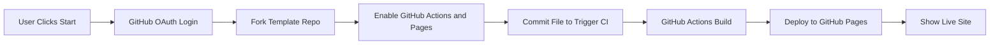

# DevOps Pipeline — GitHub Actions + Pages CI/CD Demo

This project showcases a fully automated **CI/CD pipeline** experience.
Users can trigger a live workflow that:

1. Connects their GitHub account (OAuth)
2. Forks a template repository automatically
3. Enables GitHub Actions on the fork
4. Commits a change to trigger CI workflow
5. Builds and deploys a live site using **GitHub Pages**
6. Tracks deployment progress via the GitHub Actions API


---

## Features

| Feature                 | Description                                        |
| ----------------------- | -------------------------------------------------- |
| OAuth Authentication    | Secure login to GitHub using server-proxied OAuth  |
| Automated Repo Forking  | Forks a starter template directly to user’s GitHub |
| Enable Workflows        | Guides the user through required GitHub approval   |
| Auto-Commit Changes     | Pushes commits that trigger CI builds              |
| GitHub Pages Deployment | Publishes a live website automatically             |
| Live Build Status       | Polls GitHub Actions API in real-time              |
| Error Handling + Retry  | Graceful fallback for failed build attempts        |

---

## Pipeline Flow



---

## Requirements

| Requirement                    | Version  |
| ------------------------------ | -------- |
| Node.js                        | 18+      |
| GitHub OAuth App               | Required |
| GitHub Actions & Pages enabled | Platform |

Your `.env` should include:

```
GITHUB_CLIENT_ID=
GITHUB_CLIENT_SECRET=
DEMO_OWNER=
DEMO_REPO=
```


---

## Running Locally

```bash
pnpm install
pnpm run dev
```

Open: **[http://localhost:3000](http://localhost:3000)**

---
